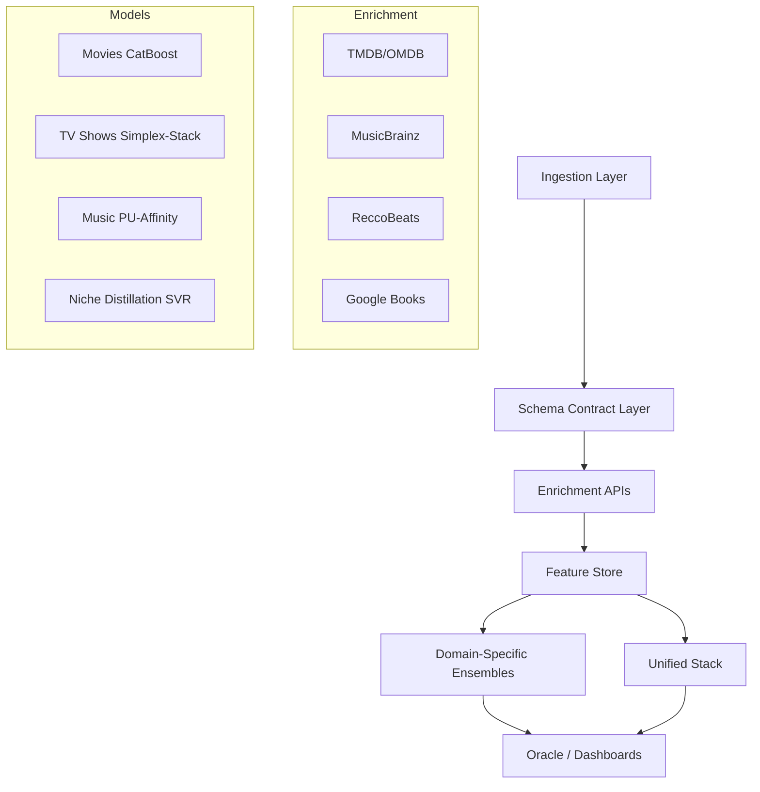

# Personal Media Intelligence Hub

## Table of Contents
- [Introduction](#introduction)
- [Architecture](#architecture)
- [Key Features](#key-features)
- [Engineering Highlights](#engineering-highlights)
- [Performance Benchmarks](#performance-benchmarks)
- [Technology Stack](#technology-stack)
- [Setup and Installation](#setup-and-installation)
- [Unified Media Intelligence](#unified-media-intelligence)
- [Dashboards & Visualizations](#dashboards--visualizations)
- [The Oracle (Explainable Recommendations)](#the-oracle-explainable-recommendations)

## Introduction
The **Personal Media Intelligence Hub** is a sophisticated "Global Taste Engine" designed to map, analyze, and predict personal entertainment preferences across five distinct domains: Movies, TV Shows, Music, Games, and Books. By consolidating fragmented media consumption data and enriching it with high-fidelity metadata from external APIs, the system builds a unified semantic representation of "Taste" that allows for cross-domain discovery and explainable recommendations.

## Case Study: When fixing the evaluation made the numbers worse

A crucial part of this project involved recognizing and correcting inflated metrics in data-sparse domains (Games and Books, N ≈ 60). Initially, a single validation split suggested a promising R² of ~0.45. However, this was a statistical artifact. 

By migrating to a rigorous **10-fold × 5-repeat Cross-Validation** protocol, the true signal emerged: an R² near 0.0. While superficially disappointing, this was a critical finding:
1.  **Metric Treachery:** In domains where ratings cluster tightly (e.g., 3.0 to 4.5), variance is tiny. R² becomes highly sensitive to noise, hovering near zero even when the Mean Absolute Error (MAE) is genuinely useful.
2.  **The Distillation Prior:** The models were effectively predicting the domain mean, heavily influenced by the cross-domain prior. There was no detectable *local* signal at that sample size.
3.  **The Pivot to Skill Score:** We reframed the evaluation metric from R² to **Skill Score** (`1 - MAE_model / MAE_baseline`), focusing on whether the system adds value over a simple historical average. 
4.  **Uncertainty & Acquisition:** We shifted the focus for these domains from raw accuracy to active learning. By surfacing **split-conformal prediction intervals** (e.g., "3.5 ± 1.3"), the Oracle now explicitly quantifies its uncertainty, guiding the user to deliberately rate the most informative backlog items to efficiently bridge the data gap.

Reviewers see inflated metrics daily; accurately deflating them and extracting a robust path forward demonstrates true ML maturity.

## Architecture

## Dataset Schemas

The system orchestrates a multi-domain data lake with strictly enforced schema contracts. Each domain is enriched from specialized APIs before being projected into a 93-feature shared latent space.

### 🎬 Movies (TMDB/OMDB)
| Category | Features |
| :--- | :--- |
| **Numerical** | Year, Runtime, IMDb Rating/Votes, Metascore, RT%, Box Office (Log), Popularity, Awards (Wins/Noms) |
| **Categorical** | Language, Genres (Multi-hot), MPAA Rating (Adult/Teen/General) |
| **Relational** | Target-encoded Directors, Actors, and Director-Genre interactions |
| **Vibe (NLP)** | 384-d MiniLM-L6-v2 Embeddings reduced to 25 PCA components from Plot + Cast + Director |

### 📺 TV Shows (TMDB)
| Category | Features |
| :--- | :--- |
| **Numerical** | Year, Vote Average, Vote Count (Log), Season Count |
| **Categorical** | Network (Top 10), Genres (Freq-gated), Age Rating (is_adult) |
| **Vibe (NLP)** | TF-IDF (30 features) on Show Overviews |

### 🎵 Music (MusicBrainz/ReccoBeats)
| Category | Features |
| :--- | :--- |
| **Numerical** | Release Year, Popularity, PU-calibrated Affinity Rating |
| **Categorical** | Artist Genres (Multi-hot), Artist Name |
| **Metadata** | Track ID, Album Name, MB-Tags |

### 🎮 Games (RAWG)
| Category | Features |
| :--- | :--- |
| **Numerical** | Year, Metacritic Score, Global Rating, Ratings/Reviews Count |
| **Categorical** | Platforms, Genres, Developers (Multi-hot, Freq >= 2) |
| **Vibe (NLP)** | MiniLM-L6-v2 Embeddings (15 PCA components) from Name + Tags + Description |

### 📚 Books (Google Books)
| Category | Features |
| :--- | :--- |
| **Numerical** | Year, Page Count, Average Rating, Ratings Count |
| **Categorical** | Authors, Categories (Multi-hot, Freq >= 2) |
| **Vibe (NLP)** | MiniLM-L6-v2 Embeddings (15 PCA components) from Title + Authors + Description |

### 📺 YouTube (YouTube Data API v3)
| Category | Features |
| :--- | :--- |
| **Video** | Video ID, Duration, Tags, Description, Views, Likes, Comment Count |
| **Channel** | Channel ID, Title, Subscriber Count, Video Count |

### 🌐 Unified Schema (Cross-Domain)
The **Unified Model** aligns all domains by mapping heterogeneous fields to a common backbone:
- **Identity:** `media_type` indicator + `has_{domain}_feats` binary masks.
- **Narrative:** Shared 10-d PCA Vibe space from unified text content.
- **Commercial:** Log-normalized Box Office / Budget / Popularity proxies.
- **Quality:** Critic-average-5 (blended normalization of IMDb, RT, Metascore, and RAWG/Google ratings).

## Key Features
- **Consolidated Library:** A single-pipeline architecture managing over **1,250 rated items** across four domains and **3,600+ music tracks**.
- **Advanced ML Ensemble:** Combines XGBoost, CatBoost, and SVR through a Ridge-based Stacking Regressor.
- **Explainable Oracle:** Predicts star ratings and provides "Verdicts" based on SHAP waterfall explanations and semantic similarity.
- **Taste Diversity Analytics:** Tracks **Taste Entropy** (Shannon Diversity) and temporal drift across your library.
- **Multi-Modal Fusion:** Integrates acoustic features, episodic metadata, and plot vibes into a single 93-feature shared latent space.

## Engineering Highlights

- **Domain Centroid Alignment (CORAL):** Corrects domain shift in the shared embedding space by centering embeddings per media type, ensuring that "vibes" are comparable across Movies, Games, and Books.
- **Frozen-Fold Evaluation Registry:** Uses a deterministic `fold_registry.json` to ensure all cross-validation experiments use identical splits, eliminating metric drift and enabling paired statistical testing.
- **Asymmetric Edge-Penalty Loss:** Custom XGBoost objective derived to penalize errors more heavily at the extremes (favorites and hard passes).
  $$L(e, r) = \frac{1}{2}e^2 \cdot \exp(\alpha_{hi} \cdot \max(0, r - 4.0) + \alpha_{lo} \cdot \max(0, 1.5 - r))$$
- **Joint Optuna Tuning:** Hyperparameters and asymmetric penalty coefficients are jointly optimized under **5×2 Repeated Cross-Validation**.
- **Positive-Unlabeled (PU) Learning:** Solves the implicit feedback problem for music by sampling pseudo-negatives and using quantile calibration to map affinity to pseudo-ratings.
- **Transfer Learning via Distillation:** Niche domains (Games/Books) use the Unified Model's predictions as a prior feature, allowing local SVRs to learn domain-specific corrections from sparse data.
- **Temporal Taste Decay:** Implementation of floored exponential sample weighting ($w_i = \max(\exp(-\lambda \Delta t_i), w_{min})$) to account for evolving preferences without catastrophic forgetting.

## Performance Benchmarks

| Domain | N | Model | R² (CV mean) | MAE | ±0.5★ Accuracy |
| :--- | :--- | :--- | :--- | :--- | :--- |
| **Movies** | 980 | CatBoost-Stack | **0.612** | 0.458 | 74.2% |
| **Unified** | 1,264 | Domain-Aligned Stack | **0.523** | 0.489 | 78.0% |
| **TV Shows** | 159 | Simplex-Stack | **0.325** | 0.534 | 68.2% |
| **Games** | 62 | Distilled SVR | **0.005** | 0.773 | 68.5% |
| **Books** | 63 | Distilled SVR | **-0.002** | 0.576 | 65.2% |

*Note: Metrics reflect robust 10-fold x 5-repeat cross-validation with frozen folds.*

## Technology Stack
- **UI/Frontend:** Streamlit, Vanilla CSS, Plotly.
- **Core ML:** XGBoost, CatBoost, Scikit-Learn, Optuna, SHAP.
- **NLP:** SentenceTransformers (`all-MiniLM-L6-v2`), UMAP.
- **Data:** Pandas, Pydantic (Schema Contracts), Joblib.
- **APIs:** TMDB, OMDb, RAWG, Google Books, YouTube Data API v3, ReccoBeats, MusicBrainz.

## Dashboards & Visualizations
- **Latent Space Explorer:** UMAP projection of the 384-d semantic space, clustering items by "vibe."
- **Model Calibration:** Reliability diagrams binned by prediction confidence to ensure "honest" metrics.
- **Taste Drift Timeline:** 90-day rolling Shannon entropy over genre distributions.
- **SHAP Waterfall:** Per-prediction explainability in the Oracle UI.

---
*Created and maintained by the Personal Media Intelligence Hub Team.*
