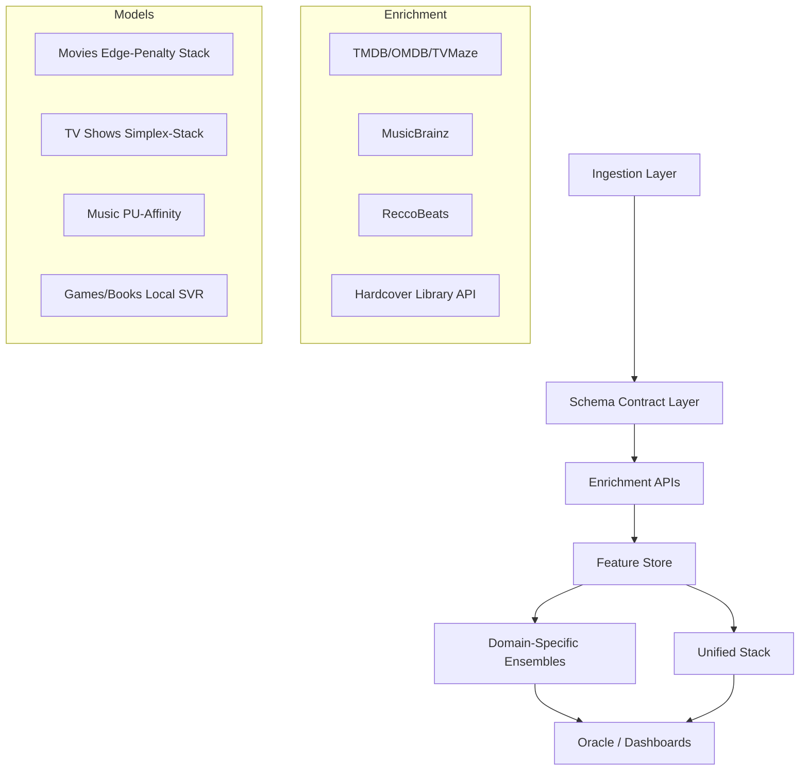

# Personal Media Intelligence Hub

## Table of Contents
- [Introduction](#introduction)
- [Architecture](#architecture)
- [Key Features](#key-features)
- [Engineering Highlights](#engineering-highlights)
- [Performance Benchmarks](#performance-benchmarks)
- [Technology Stack](#technology-stack)
- [Setup and Installation](#setup-and-installation)
- [Running the Project](#running-the-project)
- [Unified Media Intelligence](#unified-media-intelligence)
- [Dashboards & Visualizations](#dashboards--visualizations)
- [The Oracle (Explainable Recommendations)](#the-oracle-explainable-recommendations)
- [Repository Structure](#repository-structure)

## Introduction
The **Personal Media Intelligence Hub** is a sophisticated "Global Taste Engine" designed to map, analyze, and predict personal entertainment preferences across five distinct domains: Movies, TV Shows, Music, Games, and Books. By consolidating fragmented media consumption data and enriching it with high-fidelity metadata from external APIs, the system builds a unified semantic representation of "Taste" that allows for cross-domain discovery and explainable recommendations.

## Case Study: When fixing the evaluation made the numbers worse

A crucial part of this project involved recognizing and correcting inflated metrics in data-sparse domains (Games and Books, N ≈ 70–90). Initially, a single validation split suggested a promising R² of ~0.45. However, this was a statistical artifact. 

By migrating to a rigorous **10-fold × 5-repeat Cross-Validation** protocol, that inflated number deflated to a **modest and unstable** R² (Games ≈ 0.35, Books ≈ 0.30 on the frozen folds — and *near-zero or negative* under stricter pooled estimators or for the unified slice). That spread is itself the lesson: R² is not a reliable yardstick here. This was a critical finding:
1.  **Metric Treachery:** In domains where ratings cluster tightly (e.g., 3.0 to 4.5), variance is tiny, so R² becomes hypersensitive to a few noisy items — swinging from ~0.36 to near-zero depending on the estimator — even when the Mean Absolute Error (MAE) is stable and genuinely useful.
2.  **The Distillation Prior — tested and dropped:** We hypothesized the unified model could anchor these sparse domains as a prior feature. A paired Wilcoxon ablation on the frozen folds said otherwise (p = 0.06 Games / 0.71 Books, both ≥ 0.05): the prior was removed. What *did* emerge once it was gone were positive **skill scores** (Games 0.260, Books 0.301) — the local models beat the mean-rating baseline, the first evidence of genuine local signal at N ≈ 60 even with R² ≈ 0.
3.  **The Pivot to Skill Score:** We reframed the evaluation metric from R² to **Skill Score** (`1 - MAE_model / MAE_baseline`), focusing on whether the system adds value over a simple historical average. 
4.  **Uncertainty & Acquisition:** We shifted the focus for these domains from raw accuracy to active learning. By surfacing **split-conformal prediction intervals** (e.g., "3.5 ± 1.3"), the Oracle now explicitly quantifies its uncertainty, guiding the user to deliberately rate the most informative backlog items to efficiently bridge the data gap.
5.  **Ablation Discipline:** We explicitly tested residual-head domain correction and Ridge-based stacking using paired Wilcoxon tests. Both were found to be actively destructive (destroying ~0.09 R²), leading to their removal in favor of a simpler, more robust Mean Ensemble.

Reviewers see inflated metrics daily; accurately deflating them and extracting a robust path forward demonstrates true ML maturity.

## Case Study: Does taste transfer across domains?

The project's central question. Two sub-stories:

**1. Two measurement bugs, two flipped conclusions.** The benchmark table once published the *unified model's per-domain OOF slice* as if it were the standalone local models — with N inflated 5× (OOF rows counted as items) and the local-model names glued on top. Repairing the writer (`assert benchmarks != slices`, per-item dedup, `assert N == n_unique_items`) forced standalone and unified to be measured with the **same estimator on the same folds**. But a second, subtler bug remained: the "local" benchmarks were *weakened proxies* (Movies = a plain 200-tree XGB, not the deployed tuned edge-penalty stacking ensemble), which flattered the unified model. Replacing the proxies with the **production local models** (measured honestly as 50-fold registry OOF) gives the final, type-split verdict: the **local model wins in Games and Books** — the domains with rich domain-specific features (Games' Metacritic/platforms; Books' author/genre multi-hots, available since the Hardcover-library refresh) — while the **unified model wins in TV**, and **Movies is a statistical tie** (0.464 local vs 0.465 pooled, within fold noise). Cross-domain pooling earns its keep *only where a domain has little local signal beyond vibe* — which, after the Books refresh, leaves TV as the clearest pooling win. Two bugs, each of which *changed the scientific conclusion* — exactly why the single-source-of-truth renderer exists.

**2. The pre-registered transfer grid.** We then asked the sharper question — not "does the pooled model win on average" but *which specific source-domain combinations* transfer into which targets, zero-shot and augmented, in the shared feature space. The decision rules were **pre-registered before any result was seen** (positive finding ⇔ augmented lift > 0, paired p < 0.05, at ≥ 2 target fractions). <!-- TRANSFER_VERDICT:BEGIN -->**Realized verdict (full 50-fold grid, domain-blind, triple-controlled): TASTE TRANSFERS — into Games, robustly from `movie + book`.** A model trained only on movie/book ratings, **having never seen a game**, predicts game ratings better than the games-only model (`movie+book→game`: zero-shot +0.110 skill, p=0.001; +0.126 at 100%, p=0.0001 — significant at **4/4** target fractions; the best subset `movie+tv+book→game` reaches +0.155). This **reverses the earlier pilot NULL** (the 6-fold pilot was underpowered) and survives **three stress controls**: (1) the [domain-identity-leak fix](#engineering-highlights); (2) a *prior-vs-transfer* control — `movie+book→game` beats every featureless constant baseline (MAE 0.99 vs ~1.05–1.17) and rank-tracks true ratings at Spearman +0.47, so it is content, not a better prior; and (3) an *embedding text-length normalization* — **and this one was decisive.** The shared vibe space was distorted by text length (movie plots ~214 chars vs game descriptions ~1074); on the raw-length embeddings the transfer measured only +0.05 and was **not** significant. **Length-normalizing the production embeddings** (genre-templated, first-40-word descriptions) *unmasked* the effect — every Games-source config now clears 4/4, confirming genuine content transfer rather than a text-shape artifact. Reconciliation with the benchmark table: Games' rating has a *domain-specific* part (Metacritic/platforms — only the local SVR sees it) and a *genre/vibe* part that lives in the shared space and transfers from movies/books. Aligned-space distance does not predict transfer (Spearman ≈ −0.18); *target data-starvation* does. Full results in the **Transfer Atlas** page and `reports/transfer_grid_summary.json`.<!-- TRANSFER_VERDICT:END --> Pre-registering the rule *before* running, reporting the reversal when the full grid crossed the bar, then stress-testing it three ways before finalizing — that discipline is the point.

## Architecture



## Dataset Schemas

The system orchestrates a multi-domain data lake with strictly enforced schema contracts. Every domain moves through **two schema layers**, and both are documented below because they answer different questions:

1. **Ingested schema** — the raw fields each external API returns, persisted to `data/processed/<domain>/enriched_data.csv`. This is what is *collected*.
2. **Training schema** — the engineered numeric feature matrix actually fed to the models, persisted to `data/processed/<domain>/training_features.csv` (and `…/unified/training_features.csv`). This is what is *learned from*.

The per-domain models train on their own engineered matrix; the **Unified Model** re-projects every domain into a single **397-feature** shared latent space (vibe PCA aligned via CORAL). Column counts below are the live widths of the on-disk training matrices.

> **Convention.** `target_reg` is the 0.5★-grid user rating (the regression label); `target_ordinal` is its 10-bucket integer encoding (0.5★→0 … 5.0★→9); `target_class` is a coarse low/med/high bin kept for legacy dashboards. These label columns are excluded from every feature count quoted below.

### 🎬 Movies (TMDB + OMDb)
**Ingested** (`enriched_data.csv`, 36 raw fields): `tmdb_id, imdb_id, letterboxd_name/uri, year, title, rated, released, runtime, genre, director, writer, actors, plot, overview, tagline, language, country, awards, imdb_rating, imdb_votes, metascore, rotten_tomatoes_rating, box_office, production, popularity, vote_average, vote_count, user_rating, is_liked, …` (+ poster/backdrop art, processing status).

**Training** (`training_features.csv`, **66 features**):
| Category | Engineered features |
| :--- | :--- |
| **Numerical (12)** | Year, Runtime, IMDb Rating, IMDb Votes, Metascore, RT%, `box_office_log` (log1p), Popularity, Vote Average, Awards `total_wins`/`total_nominations` (regex-parsed), `critic_avg_5` (blended IMDb/Metascore/RT/TMDB on a 5★ scale) |
| **Categorical** | Language one-hot (top-3 + Other), Genres multi-hot (`MultiLabelBinarizer`), MPAA bucket (`rated_Adult/Teen/General`) |
| **Relational (3)** | Leakage-safe **target encodings** — Director, Actors, Director×Genre — Bayesian-smoothed (m=10) over 5-fold out-of-fold splits |
| **Vibe (NLP)** | 384-d MiniLM-L6-v2 embedding of *Title + Director + Plot* → **25 PCA components** |

### 📺 TV Shows (TMDB + TVMaze + OMDb)
**Ingested** (`enriched_data.csv`, 35 raw fields): `tmdb_id, tvmaze_id, name, year, overview, tagline, created_by, genres, vote_average, vote_count, imdb_rating, imdb_votes, number_of_episodes, number_of_seasons, status, network, language, runtime, first_air_date, last_air_date, age_rating, awards, actors, writer, country, production_companies, user_rating, watch_count, …`.

**Training** (`training_features.csv`, **38 features**):
| Category | Engineered features |
| :--- | :--- |
| **Numerical (5)** | Year, Vote Average, `vote_count_log` (log1p), Season Count, `is_adult` |
| **Categorical** | Network one-hot (top-10 + Other, `net_`), Genres multi-hot frequency-gated at ≥5% of N (`g_`) |
| **Vibe (NLP)** | 384-d MiniLM-L6-v2 embedding of *Title + Network + Overview* → **15 PCA components** |

### 🎮 Games (RAWG)
**Ingested** (`enriched_data.csv`, 16 raw fields): `name, my_rating, platform_from_text, released, age_rating, genres, developers, publishers, metacritic, rating, ratings_count, reviews_count, tags, description_raw, playtime, cover`. Ratings include the sentinel **`'I'` (Incomplete)** → mapped to NaN (kept for ranking, excluded from supervised scoring).

**Training** (`training_features.csv`, **55 features**):
| Category | Engineered features |
| :--- | :--- |
| **Numerical (5)** | Year, Metacritic, Global Rating, Ratings Count, Reviews Count |
| **Categorical** | Platform one-hot (`plat_`), Genres multi-hot (`gen_`), Developers multi-hot frequency-gated at ≥2 (`dev_`) |
| **Vibe (NLP)** | 384-d MiniLM-L6-v2 embedding of *Name + Genres + Tags + Description* → up to **15 PCA components** (`min(15, N−1)`) |

### 📚 Books (Hardcover Library API)
**Ingested** (`enriched_data.csv`, 13 raw fields): `title, isbn, my_rating, authors, publisher, publishedDate, pageCount, categories, averageRating, ratingsCount, description, thumbnail, infoLink`. The dataset is pulled **entirely from the authenticated user's Hardcover library** (`user_books` with a rating) via the GraphQL API — title, rating, authors, genres, page count and description all come from one library record, so there is no `book.txt`/CSV input and no fuzzy title/ISBN join. (The Books *Oracle* still queries Open Library live for arbitrary unrated books.)

**Training** (`training_features.csv`, **133 features**):
| Category | Engineered features |
| :--- | :--- |
| **Numerical (4)** | Year, Page Count, Average Rating, Ratings Count |
| **Categorical** | Authors multi-hot frequency-gated at ≥2 (`aut_`), Categories multi-hot (`cat_`) |
| **Vibe (NLP)** | 384-d MiniLM-L6-v2 embedding of *Title + Authors + Categories + Description* → up to **15 PCA components** (`min(15, N−1)`) |

### 🎵 Music (Spotify + ReccoBeats + MusicBrainz + Genius)
Music has **no ground-truth star ratings**; its label is a PU-classifier-calibrated *affinity* (see [PU Learning](#engineering-highlights)). Features land in `music_features.npz` (StandardScaler-normalized numerics).

**Ingested**: Spotify library/playlists (`track_id, name, primary_artist, album, popularity, artist_followers, …`), ReccoBeats **9 audio features** (`acousticness, danceability, energy, instrumentalness, liveness, loudness, speechiness, tempo, valence`), MusicBrainz (`mb_genres, mb_tags, mb_length_ms`), Genius (`lyrics`, VADER sentiment).

**Training** (engineered matrix):
| Category | Engineered features |
| :--- | :--- |
| **Numerical** | Duration, Release Year, Track Age, Popularity, Artist Popularity/Followers (log), Album/Track position, Explicit |
| **Audio (ReccoBeats)** | The 9 audio features above, each median-imputed **+ a `_missing` flag** |
| **Lyrical** | Word/line counts, unique-word ratio, VADER sentiment (`pos/neu/neg/compound`), `lyrics_found` |
| **Categorical** | Genres/Tags multi-hot (top-60, `g_`), Artists multi-hot (top-40, `a_`) |
| **Vibe (NLP)** | MiniLM-L6-v2 embedding of *Name + Genres + MB-Tags + Lyric snippet* → **32 PCA components** (`emb_`) |

### 📺 YouTube (YouTube Data API v3)
Ingestion-only (no rating model). **Video:** Video ID, Duration, Tags, Description, Views, Likes, Comment Count. **Channel:** Channel ID, Title, Subscriber Count, Video Count.

### 🌐 Unified Schema (Cross-Domain, 397 features)
The Unified Model concatenates every domain into one row-space (`data/processed/unified/training_features.csv`, **402 columns = 397 features + 5 bookkeeping** [`target_reg, target_ordinal, rating_date, source_id, media_type`]). Heterogeneous fields are mapped onto a common backbone:
- **Identity:** `is_tv_show/is_game/is_book/is_music` indicators + `has_{movie,tv,game,book,music}_feats` multi-modal missingness masks (so the model can tell an absent feature from a real zero).
- **Narrative:** A single **10-d PCA vibe space** over unified text (*Title + Lead + Overview*), with **CORAL/centroid alignment fit per training fold** (no leakage) so "vibe" geometry is comparable across domains.
- **Genre/Rating:** Cross-domain genre multi-hot (`gen_`, with `Sci-Fi & Fantasy`/`Action & Adventure` split into atomic genres), language one-hot, MPAA bucket.
- **Commercial:** Log-normalized Box Office / Popularity proxies.
- **Quality:** `critic_avg_5` — blended, scale-normalized average of IMDb, RT, Metascore, and RAWG/Google ratings.
- **Cross-domain audio:** Gated music-affinity features (active only where the transfer matrix licenses them).

## Feature Engineering Deep-Dive

> This section explains, per domain, **how every pulled field becomes a model feature, what each feature contributes, and which features actually drive the predictions** (measured with SHAP, not assumed). All feature lists below are the *live on-disk columns* of `training_features.csv`; the SHAP and coverage numbers are generated by `python -m src.experiments.feature_diagnostics` (charts in `reports/shap_<domain>.png`).
>
> **The universal recipe** (every domain shares it): *numeric metadata* (cleaned, `log1p` on skewed money/counts) → *categoricals* multi/one-hot (frequency-gated to control width) → *text "vibe"* (concatenate title+creator+description → `all-MiniLM-L6-v2` 384-d embedding → PCA) → save a `joblib` **state** (medians, fitted PCA, fitted encoders, column list) so inference rebuilds the *identical* matrix (train-serve parity). The label is `target_reg` (0.5★ grid), with `target_ordinal` (10 buckets) and `target_class` (coarse) alongside.

### 🎬 Movies — 66 features
| Feature group | Fields & how they're used |
| :--- | :--- |
| **Critic numerics (12)** | `imdb_rating, metascore, rotten_tomatoes_rating, vote_average, imdb_votes, critic_avg_5` (scale-normalized blend of the four critic scores), `year, runtime, popularity, box_office_log` (log1p), `total_wins, total_nominations` (regex-parsed from the free-text awards string). |
| **Categorical** | `lang_*` one-hot (top-3 + Other), `gen_*` genre multi-hot (`MultiLabelBinarizer`), `rated_Adult/Teen/General` MPAA bucket. |
| **Vibe (25)** | `pca_0…24` — PCA of the MiniLM embedding of *Title + Director + Plot*. |
| **Target encodings** *(computed, see caveat)* | `feature_engineering.py` builds leakage-safe, Bayesian-smoothed (m=10), 5-fold out-of-fold encodings for **Director, Actors, Director×Genre**. |
| **What drives it (SHAP)** | `critic_avg_5` (0.206) and `imdb_rating` (0.196) dominate, then `year` (0.087), `rotten_tomatoes_rating` (0.081), `vote_average` (0.059); embeddings/box-office/nominations are minor. **Movies are a critic-consensus model** — your taste tracks blended critic scores plus a year/recency effect. |

> ⚠️ **Target-encoding caveat (a real "use-what-you-have" lever).** The leakage-safe Director/Actor/Dir×Genre encodings are computed in `feature_engineering.py`, but the **currently persisted** `training_features.csv` (66 cols) **does not contain** `director_encoded`/`actors_encoded` columns — so the standalone-benchmark XGB and the SHAP run above never see them. If those encodings carry signal (they should, for an auteur-driven rater), wiring them into the persisted matrix is a cheap potential accuracy gain. Worth a one-line check that the encodings reach the deployed model.

### 📺 TV — 38 features
| Feature group | Fields & how they're used |
| :--- | :--- |
| **Numeric (5)** | `year, vote_average, vote_count_log` (log1p), `season_count, is_adult`. |
| **Categorical** | `net_*` network one-hot (top-10 + Other), `g_*` genre multi-hot (gated at ≥5% of N). |
| **Vibe (15)** | `pca_0…14` — MiniLM embedding of *Title + Network + Overview*. |
| **What drives it (SHAP)** | `vote_average` (0.257) dominates everything; the rest of the signal is **embeddings** (`pca_0/14/3/9…`), then `vote_count_log` and `year`. TV has thin metadata (no critic blend, no box office, no awards) — which is precisely why it's the weakest domain (R²≈0.05). The problem is *feature richness*, not N (the local learning curve plateaus — see `ERR_TXT_DIAGNOSTICS_REPORT.md`). |

### 🎮 Games — 55 features
| Feature group | Fields & how they're used |
| :--- | :--- |
| **Numeric (5)** | `metacritic, rating` (RAWG global), `ratings_count, reviews_count, year`. |
| **Categorical** | `plat_*` platform one-hot, `gen_*` genre multi-hot, `dev_*` developer multi-hot (gated at ≥2). |
| **Vibe (15)** | `pca_0…14` — MiniLM embedding of *Name + Genres + Tags + Description*. |
| **What drives it (SHAP)** | `ratings_count` (0.196), `rating` (0.169), `metacritic` (0.075), then embeddings and `year`. **These RAWG community-signal columns are the entire reason Games needs a *local* model** — they live *outside* the shared cross-domain space, so the unified model can't see them. (This is why the local Games model massively outperforms the unified slice, and why the local learning curve is still climbing — see diagnostics.) |

### 📚 Books — 133 features *(feature-starvation fixed by the Hardcover library API)*
| Feature group | Fields & how they're used |
| :--- | :--- |
| **Numeric (4)** | `year, pageCount, averageRating, ratingsCount`. |
| **Categorical** | `aut_*` author multi-hot (8, gated at ≥2), `cat_*` category/genre multi-hot (106, ungated). |
| **Vibe (15)** | `pca_0…14` — MiniLM embedding of *Title + Authors + Categories + Description*. |
| **What drives it (SHAP)** | Still embedding-led, but the author/genre multi-hots now contribute real local signal — the books-only SVR's skill over the mean baseline is **+0.301** (vs the unified slice's near-zero), and the local model now beats the unified slice on MAE (0.466 vs 0.483). |

> ✅ **Books is no longer feature-starved — this was the documented "#1 accuracy lever," and migrating ingestion to the Hardcover *library* API closed it.** The old Open-Library-enriched file left Books with **zero** author/category multi-hots (sparse, non-standard subjects died at the ≥2 gate) and three **dead unified channels** (`critic_avg_5 = 0.00`, `runtime = 0.00`, `gen_* = 0.00`). Pulling each book straight from one Hardcover library record fixes both: locally Books now carries **8 author + 106 standardized-genre columns**, and in the *unified* space the same three channels are now **~100% populated** (`gen_* 0.98`, `critic_avg_5 1.00`, `runtime 1.00`). The downstream effect is visible in the benchmark table — the **local Books model now wins** (it has real local features to exploit), where the old data had the unified slice marginally ahead.

### 🎵 Music — 127 features (implicit label)
Music has no star ratings; the label is a synthesized implicit rating (`2.5 + 1.5·saved + 0.4·playlists(cap 1.0) + 2.0·(1−rank/99) + 0.5·popularity`), and affinity is PU-calibrated.
| Feature group | Fields & how they're used |
| :--- | :--- |
| **Meta numerics** | `duration_min, release_year, track_age, popularity, artist_popularity, artist_followers_log, album_total_tracks, track_number, explicit`. |
| **Audio (ReccoBeats, 9×2)** | `acousticness, danceability, energy, instrumentalness, liveness, loudness, speechiness, tempo, valence` — each **median-imputed + a `_missing` flag** so the model distinguishes a real 0 from absent data. |
| **Lyrical** | VADER sentiment (`pos/neu/neg/compound`), word/line/unique-word counts, `lyrics_found`. |
| **Categorical** | `g_*` genres/tags multi-hot (top-60), `a_*` artists multi-hot (top-40). |
| **Vibe (32)** | `emb_0…31` — MiniLM embedding of *Name + Genres + MB-tags + Lyric snippet*. |

### 🌐 Unified cross-domain — 397 features
Every domain is re-projected onto one backbone so a single model can score anything:
- **Schema harmonization:** heterogeneous fields renamed onto a shared backbone (game `developers`→`director`, book `pageCount`→`runtime`, etc.).
- **Identity & missingness:** `is_{tv,game,book,music}` + `has_{domain}_feats` masks so the model can tell an absent feature from a real zero. *(These are deliberately dropped in the transfer grid — see below.)*
- **Shared vibe:** a single **10-d** PCA over unified text, **CORAL/centroid-aligned per training fold** so "vibe" geometry is comparable across domains (leakage-safe).
- **Shared genre / quality / commercial:** cross-domain `gen_*` multi-hot, `critic_avg_5` (scale-normalized IMDb/RT/Metascore/RAWG blend), `box_office_log`/`popularity`.
- **Coverage reality (measured):** the shared channels are now dense for **all four rated domains** — the previously-dead Books channels (`critic_avg_5`, `runtime`, `gen_*`) are populated at ~100% since Books moved to the Hardcover library API (see the Books note above). Pooling can only help a domain on the channels it actually populates, and Books now populates all of them.

### 🔀 Transfer-learning features
The transfer grid (`transfer_study.py`) operates in a **domain-blind** subset of the unified space: it keeps `pca_*` (CORAL-aligned), `gen_*`, `critic_avg_5`, `year`, `popularity`, and **deliberately drops** the `is_*`/`has_*_feats` identity columns — otherwise a "transfer" model could cheat by splitting on domain identity instead of learning shared content. Genres are capped to the top-40 most frequent. This is why **taste transfer is measured only on shared content** (vibe + genre + critic + year), and why Games — whose real signal is the *local* RAWG columns the shared space excludes — both transfers *in* well (its shared-space self-signal is weak) yet still needs its local model for production.

### Diagnostics summary (per-base-learner ablation)
Are the ensembles complementary or is one member dead weight? (`feature_diagnostics.py`, 50 folds, skill = beats predict-the-mean.)
| Domain | XGB alone | CatBoost alone | SVR alone | Mean blend | Simplex blend | Read |
| :--- | :--- | :--- | :--- | :--- | :--- | :--- |
| **Movies** | 0.386 | 0.372 | 0.352 | **0.392** | 0.384 | **Complementary** — mean beats every member; no dead weight. |
| **TV** | 0.038 | 0.099 | **0.110** | 0.095 | 0.078 | **Mis-weighted** — XGB is near-dead-weight and the blend *underperforms SVR-alone*; TV would be better as a plain SVR. |

## Key Features
- **Consolidated Library:** A single-pipeline architecture managing over **1,250 rated items** across four domains and **3,600+ music tracks**.
- **Advanced ML Ensemble:** Combines XGBoost and CatBoost through a Simplex-constrained Mean Ensemble for robust cross-domain fusion.
- **Explainable Oracle:** Predicts star ratings and provides "Verdicts" based on SHAP waterfall explanations and semantic similarity.
- **Taste Diversity Analytics:** Tracks **Taste Entropy** (Shannon Diversity) and temporal drift across your library.
- **Multi-Modal Fusion:** Integrates acoustic features, episodic metadata, and plot vibes into a 397-feature shared latent space.

## Engineering Highlights

- **Domain Centroid Alignment (CORAL):** Corrects domain shift in the shared embedding space by centering embeddings per media type, ensuring that "vibes" are comparable across Movies, Games, and Books.
- **Frozen-Fold Evaluation Registry:** Uses a deterministic `fold_registry.json` to ensure all cross-validation experiments use identical splits, eliminating metric drift and enabling paired statistical testing.
- **Asymmetric Edge-Penalty Loss:** Custom XGBoost objective derived to penalize errors more heavily at the extremes (favorites and hard passes).
  $$L(e, r) = \frac{1}{2}e^2 \cdot \exp(\alpha_{hi} \cdot \max(0, r - 4.0) + \alpha_{lo} \cdot \max(0, 1.5 - r))$$
- **Joint Optuna Tuning:** Hyperparameters and asymmetric penalty coefficients are jointly optimized under **5×2 Repeated Cross-Validation**.
- **Rank/Quantile Calibration (the real fix for regression-to-the-mean):** An MAE-trained regressor on clustered ratings (62% of movies are 3–4★) learns to hug the mode and *never predicts 5★* — which quietly inflates ±0.5★ accuracy for free. We apply a leakage-safe, **monotone** post-hoc map: each prediction's *rank* (vs the training-fold predictions) is mapped onto the empirical rating distribution (`np.quantile(y_train, rank)`), so the output distribution *equals* the real rating curve by construction and the model recovers the full 0.5–5★ range. Because it's ranking-preserving, it helps **exactly in proportion to ranking quality (Spearman ρ)**: a **net win for Games (ρ=0.84, MAE 0.652→0.598) and Books (ρ=0.70)** — which ranked well but compressed every prediction into [2,4] — a **deliberate accuracy-for-coverage trade for Movies** (ρ=0.74: +45 genuine 5★ predictions for ~4pts of ±0.5★ Acc), and **skipped for TV** (ρ=0.45 is too weak — calibration would stamp 5★ on the wrong shows). *Calibrate where the order is trustworthy.*
- **Positive-Unlabeled (PU) Learning:** Solves the implicit feedback problem for music by sampling pseudo-negatives and using quantile calibration to map affinity to pseudo-ratings.
- **Distillation Prior (tested, then removed):** We evaluated feeding the Unified Model's predictions into the Games/Books local SVRs as a prior feature. A paired Wilcoxon ablation on the frozen folds found it **not significantly helpful** (p = 0.06 / 0.71, effect direction negative), so the prior was **dropped** — the local SVRs run on their own features. Killing a feature that doesn't earn its keep is the point, not a regression.
- **Temporal Taste Decay:** Implementation of floored exponential sample weighting ($w_i = \max(\exp(-\lambda \Delta t_i), w_{min})$). Tuning revealed preferences are remarkably stable over the library's horizon (half-life ≈ 4.4 years).

## Performance Benchmarks

<!-- BENCHMARKS:BEGIN -->
| Domain | N | Model | R² (CV mean) | MAE | ±0.5★ Accuracy |
| :--- | :--- | :--- | :--- | :--- | :--- |
| **Movies** | 1,000 | Prod Stacking (edge+Cat+SVR+Ord) | **0.501** | 0.503 | 75.5% |
| **Unified (rated)** | 1,322 | Mean Ensemble | **0.467** | 0.530 | 75.5% |
| **Unified (full pool)**† | 1,322 | Mean Ensemble (+music pool) | **0.442** | 0.547 | 74.1% |
| **TV Shows** | 162 | Prod Simplex-Stack (edge+Cat+SVR) | **0.280** | 0.648 | 66.7% |
| **Games** | 66 | Local SVR | **0.383** | 0.598 | 65.2% |
| **Books** | 88 | Local SVR | **0.332** | 0.477 | 79.5% |

*The four domain rows are the **production local models** on the frozen registry folds (one row per item, N = unique items): **Movies and TV are the deployed tuned ensembles** (Optuna edge-penalty XGB + CatBoost + SVR + ordinal-EV, fused) — not the earlier plain-XGB / manual-simplex proxies — and **Games and Books are the deployed SVR**. The two Unified rows are the cross-domain Mean Ensemble; **the rated row (N=1,322) is the headline taste metric**.*

*†Unified (full pool) is trained on the rated items **plus 3,688 music PU pseudo-labels** and evaluated including music via a separate RepeatedKFold(5×1) — music has no frozen registry. It is **not an actual-taste metric** and is shown only for transparency; never cite it as the unified result.*
<!-- BENCHMARKS:END -->

*Note: Metrics reflect robust 10-fold × 5-repeat cross-validation with frozen folds. All numbers render from `reports/latest_metrics.json` via `src/reporting/render_docs.py`; the raw terminal outputs of every pipeline run are captured in [`reports/PIPELINE_RUN_LOG.md`](reports/PIPELINE_RUN_LOG.md).*

## Technology Stack
- **UI/Frontend:** Streamlit, Vanilla CSS, Plotly.
- **Core ML:** XGBoost, CatBoost, Scikit-Learn, Optuna, SHAP.
- **NLP:** SentenceTransformers (`all-MiniLM-L6-v2`), UMAP.
- **Data:** Pandas, Pydantic (Schema Contracts), Joblib.
- **APIs:** TMDB, OMDb, TVMaze, RAWG, Hardcover (GraphQL), Open Library, YouTube Data API v3, Spotify, ReccoBeats, MusicBrainz, Genius.

> **Dependency note (code is the source of truth).** The list above is conceptual; the *imported* stack is pinned in `requirements.txt`. A few libraries were trialled and never wired in — `statsmodels`, `pandera`, `librosa`, `soundfile`, `omdb`, and `yt-dlp` are **not imported anywhere**. In particular: statistical tests use `scipy.stats` (not statsmodels); schema contracts use **Pydantic** only (not pandera); there is **no raw-audio DSP** — the 9 audio features come from the **ReccoBeats REST API** via `requests` (Spotify deprecated its audio-features endpoint for new apps on 2024-11-27); OMDb is a direct `requests` call; and YouTube uses the official **Data API v3** via `google-api-python-client`. These were pruned from `requirements.txt`.
>
> **Source provenance (verified against `src/<domain>/ingestion.py`).** Movies = TMDB + OMDb · TV = TMDB + TVMaze + OMDb · Games = RAWG · Books = **Hardcover library API (GraphQL)** · Music = Spotify + ReccoBeats + MusicBrainz + Genius. The rated Books dataset is now pulled in full from the user's Hardcover library; the Books **Oracle** additionally queries Open Library live for arbitrary unrated titles. Books requires `HARDCOVER_API_KEY` (a full `Bearer <jwt>` string); **TVMaze and Open Library are keyless**. (Earlier drafts mislabelled Books as "Google Books" and TV as "TMDB"-only — corrected throughout.)

## Dashboards & Visualizations
- **Latent Space Explorer:** UMAP projection of the 384-d semantic space, clustering items by "vibe."
- **Model Calibration:** Reliability diagrams binned by prediction confidence to ensure "honest" metrics.
- **Taste Drift Timeline:** 90-day rolling Shannon entropy over genre distributions.
- **SHAP Waterfall:** Per-prediction explainability in the Oracle UI.
- **Transfer Atlas:** Cross-domain affinity heatmap, augmented learning curves, and the similarity↔transfer scatter — the centerpiece of the transfer study.

## Limitations
Honest constraints, stated plainly:
- **Aleatoric ceiling.** Ratings are self-reported on a 0.5★ grid; intrinsic noise caps achievable R²/MAE, especially after rounding. MAE-skill is the more honest yardstick in low-variance domains.
- **Small-N domains.** Games (N=72) and Books (N=88) are pilots, not production claims; their R² is treacherous (near-zero variance), so we lead with skill score and conformal intervals, and the entity-bridge result is explicitly framed as a pilot with CIs.
- **PU pseudo-label caveat.** Music has no ground-truth ratings; its "ratings" are PU-classifier-calibrated affinities. Any pooled metric that scores music (the *Unified (full pool)* row) is the model partly predicting another model's output — reported only as a footnoted, secondary line.
- **Single-user dataset.** Everything is one person's taste. Nothing here generalizes across users; multi-user generalization is explicitly out of scope.
- **Transfer grid scope.** The shipped grid result is a documented **pilot** (subset of the 50 registry folds, 150-tree XGB proxy for the Mean Ensemble). The harness runs the full 50-fold/300-tree grid via `transfer_study.py full`; the verdict is reproducible either way.

## Setup and Installation

### 1. Prerequisites
- **Python 3.12**
- A few free API keys (see below). Every key is optional in the sense that you can run any single domain in isolation; you only need the keys for the domains you intend to (re)ingest.

### 2. Install dependencies
```bash
# from the repository root
python -m venv .venv
# Windows
.venv\Scripts\activate
# macOS / Linux
source .venv/bin/activate

pip install -r requirements.txt
```

### 3. Configure API keys
Create a `.env` file in the repository root:
```env
TMDB_API_KEY=...            # Movies + TV metadata
OMDB_API_KEY=...            # Movies + TV IMDb/RT/Metascore enrichment
RAWG_API_KEY=...            # Games metadata
HARDCOVER_API_KEY=...       # Books metadata (Hardcover GraphQL — paste the full "Bearer <jwt>" string)
# Books also query Open Library, and TV also queries TVMaze — both are keyless, no env var needed.
YOUTUBE_API_KEY=...         # YouTube Data API v3
SPOTIPY_CLIENT_ID=...       # Music library
SPOTIPY_CLIENT_SECRET=...
SPOTIPY_REDIRECT_URI=http://localhost:8888/callback
GENIUS_ACCESS_TOKEN=...     # Music lyrics
MUSICBRAINZ_CONTACT=you@example.com   # required by MusicBrainz fair-use policy
```

> **Note.** `data/`, `models/`, and `.env` are git-ignored, so a fresh clone ships **without** the dataset or trained models. You regenerate them by running the pipelines below. All modules import shared paths from `src/config.py`, which auto-creates the `data/` and `models/` directory tree on first run.

## Running the Project

Every module imports configuration via `from src import config`, so **run everything from the repository root with the `-m` module syntax** (not `python src/.../file.py`). On Windows, prefix with `set PYTHONUTF8=1` (PowerShell: `$env:PYTHONUTF8=1`) to avoid console-encoding errors.

### Quick start — just launch the app
If the committed `data/` and `models/` are already present, you only need:
```bash
streamlit run app/main.py
```
This opens the multi-page Streamlit hub (dashboards, Oracles, Latent-Space Explorer, Transfer Atlas).

### Full pipeline — rebuild everything from scratch
Each domain follows the same four-stage pattern: **ingest → engineer features → train → predict.**

**1. Per-domain pipelines (Movies / TV / Games / Books)**
```bash
# Movies
python -m src.movies.ingestion                  # Letterboxd export + TMDB/OMDb -> enriched_data.csv
python -m src.movies.feature_engineering        # -> training_features.csv (66 features)
python -m src.movies.model_trainer              # baseline XGB regressor/classifier
python -m src.movies.advanced_movie_model_trainer  # PRODUCTION edge-penalty stacking ensemble
python -m src.movies.predict_ratings            # score the library

# TV Shows
python -m src.shows.ingestion
python -m src.shows.feature_engineering
python -m src.shows.model_trainer
python -m src.shows.predict_ratings

# Games
python -m src.games.ingestion
python -m src.games.feature_engineering
python -m src.games.model_trainer
python -m src.games.predict_ratings

# Books
python -m src.books.ingestion
python -m src.books.feature_engineering
python -m src.books.model_trainer
python -m src.books.predict_ratings
```

**2. Music pipeline** (no star ratings — uses PU-affinity; see `src/music/readme.md`)
```bash
python -m src.music.ingestion                   # Spotify library + ReccoBeats audio features
python -m src.music.musicbrainz_enrichment      # MusicBrainz genres/tags
python -m src.music.genius_lyrics               # lyrics + VADER sentiment
python -m src.music.background_pool             # unlabeled pool for PU learning
python -m src.music.feature_engineering         # -> music_features.npz
python -m src.music.model_training              # train PU-affinity model
python -m src.music.profile_builder             # build taste profile (for the Music Oracle)
```

**3. YouTube ingestion** (no rating model)
```bash
python -m src.youtube.enrich_yt
```

**4. Unified cross-domain model**
```bash
python -m src.unified_model.unified_feature_engineering   # project all domains into the 397-feature shared space
python -m src.unified_model.create_frozen_folds           # deterministic fold_registry.json
python -m src.unified_model.advanced_unified_model_trainer  # train the unified Mean Ensemble
python -m src.unified_model.predict_unified_ratings       # unified scoring of the full library
```

**5. Evaluation & report rendering** (regenerates the metrics shown in this README)
```bash
python -m src.reporting.production_benchmarks    # production local-model benchmarks
python -m src.unified_model.comprehensive_evaluator  # writes reports/latest_metrics.json
python -m src.reporting.render_docs              # injects metrics into README + technical report
```

**6. Research experiments** (the transfer study & ablations — optional, reproduces the case studies)
```bash
python -m src.experiments.distillation_ablation        # distillation-prior Wilcoxon ablation
python -m src.experiments.latent_space_diagnostics     # 6-check wiring diagnostics
python -m src.experiments.transfer_study full          # full 50-fold transfer grid ('pilot' for the quick version)
python -m src.experiments.transfer_analysis            # aggregate grid -> verdict + summary.json
python -m src.experiments.transfer_prior_control       # prior-vs-transfer stress control
python -m src.experiments.text_norm_transfer_control   # text-normalization stress control
python -m src.linking.build_entity_links full          # cross-domain Wikidata entity links
python -m src.linking.bridge_features all              # entity-bridge feature evaluation
python -m src.evaluation.active_learning_ranker        # rebuild the active-learning queue
python -m src.evaluation.evaluate_movie_model_on_shows # cross-domain "movie model on shows" probe
```

**7. Launch the app**
```bash
streamlit run app/main.py
```

## Repository Structure

> **Legend.** 🟢 tracked source / 📦 generated artifact / 🔒 git-ignored (local-only, see `.gitignore`). Directories marked 🔒 are produced or fetched at runtime and are intentionally kept out of version control.

```text
Personal_Media_Intelligence_Hub/
│
├── README.md                         # 🟢 This document — project overview, case studies, benchmarks (auto-rendered).
├── requirements.txt                  # 🟢 Canonical Python dependency list for the project.
├── .gitignore                        # 🟢 Excludes data/, models/, secrets, caches, and scratch logs from VCS.
├── .env                              # 🔒 API keys (TMDB, OMDb, RAWG, Hardcover, YouTube, Spotify, Genius).
│
├── app/                              # 🟢 Streamlit front-end (multi-page app).
│   ├── main.py                       #    Landing page / app entry point and global layout + CSS.
│   └── pages/                        #    One file per page; numeric prefix sets sidebar order.
│       ├── 1_Movies_Dashboard.py     #    Movies analytics dashboard.
│       ├── 2_Movies_Oracle.py        #    Movies rating predictor + SHAP "Verdict" explanations.
│       ├── 3_TV_Shows_Dashboard.py   #    TV analytics dashboard.
│       ├── 4_TV_Shows_Oracle.py      #    TV rating predictor (Oracle).
│       ├── 5_Music_Dashboard.py      #    Music analytics dashboard.
│       ├── 6_Music_Oracle.py         #    Music affinity / playlist recommender.
│       ├── 7_Games_Dashboard.py      #    Games analytics dashboard.
│       ├── 8_Games_Oracle.py         #    Games rating predictor (Oracle).
│       ├── 9_Books_Dashboard.py      #    Books analytics dashboard.
│       ├── 10_Books_Oracle.py        #    Books rating predictor (Oracle).
│       ├── 11_YouTube_Dashboard.py   #    YouTube watch/engagement dashboard.
│       ├── 12_Latent_Space_Explorer.py #  UMAP projection of the shared semantic ("vibe") space.
│       ├── 13_Model_Calibration.py   #    Reliability diagrams / honest-metric calibration views.
│       ├── 14_Taste_Drift.py         #    Rolling Shannon-entropy taste-drift timeline.
│       └── 15_Transfer_Atlas.py      #    Cross-domain transfer study UI (heatmaps, learning curves).
│
├── src/                              # 🟢 All data-pipeline, ML, and analysis code.
│   ├── config.py                     #    Global paths / shared configuration constants.
│   │
│   ├── movies/                       #    Movies domain pipeline.
│   │   ├── ingestion.py              #      Pull & merge Letterboxd export + TMDB/OMDb enrichment.
│   │   ├── feature_engineering.py    #      Build the 66-feature training matrix (incl. target encodings, vibe PCA).
│   │   ├── model_trainer.py          #      Baseline XGB regressor/classifier trainer.
│   │   ├── advanced_movie_model_trainer.py # Production edge-penalty stacking ensemble (Optuna-tuned).
│   │   ├── custom_objectives.py      #      Asymmetric edge-penalty XGBoost loss.
│   │   └── predict_ratings.py        #      Score the library / new titles with the trained models.
│   │
│   ├── shows/                        #    TV Shows domain (ingestion → features → trainer → predict).
│   │   ├── ingestion.py
│   │   ├── feature_engineering.py    #      38-feature matrix (network/genre multi-hot + 15-d vibe PCA).
│   │   ├── model_trainer.py          #      Production simplex-stack ensemble.
│   │   └── predict_ratings.py
│   │
│   ├── games/                        #    Games domain (RAWG). Local SVR pipeline.
│   │   ├── ingestion.py
│   │   ├── feature_engineering.py    #      55-feature matrix (platform/genre/dev multi-hot + vibe PCA).
│   │   ├── model_trainer.py
│   │   └── predict_ratings.py
│   │
│   ├── books/                        #    Books domain (Hardcover Library API). Local SVR pipeline.
│   │   ├── ingestion.py
│   │   ├── feature_engineering.py    #      19-feature matrix (author/category multi-hot + vibe PCA).
│   │   ├── model_trainer.py
│   │   └── predict_ratings.py
│   │
│   ├── music/                        #    Music domain (Spotify + ReccoBeats + MusicBrainz + Genius).
│   │   ├── readme.md                 #      Music-subsystem-specific notes.
│   │   ├── config.py                 #      Music-specific config.
│   │   ├── schema.py                  #      Pydantic schema contracts for music records.
│   │   ├── ingestion.py              #      Spotify library/playlist ingestion.
│   │   ├── musicbrainz_enrichment.py #      MusicBrainz genre/tag/length enrichment.
│   │   ├── genius_lyrics.py          #      Genius lyric fetch + VADER sentiment.
│   │   ├── background_pool.py        #      Builds the unlabeled "pool" for PU learning.
│   │   ├── feature_engineering.py    #      Audio + lyrical + vibe feature matrix → music_features.npz.
│   │   ├── affinity.py               #      PU-affinity scoring.
│   │   ├── model_training.py         #      Trains the PU affinity model.
│   │   ├── profile_builder.py        #      Builds the user taste profile.
│   │   ├── playlist_ranker.py        #      Ranks tracks/playlists for the Music Oracle.
│   │   └── evaluation.py             #      Music model evaluation.
│   │
│   ├── youtube/                      #    YouTube ingestion (no rating model).
│   │   └── enrich_yt.py
│   │
│   ├── unified_model/                #    Cross-domain "Global Taste Engine" (397-feature shared space).
│   │   ├── unified_feature_engineering.py # Re-projects every domain into the shared CORAL-aligned space.
│   │   ├── unified_utils.py          #      Shared helpers for the unified pipeline.
│   │   ├── create_frozen_folds.py    #      Generates the deterministic fold_registry.json.
│   │   ├── advanced_unified_model_trainer.py # Trains the unified Mean Ensemble (XGB/CatBoost/SVR/ordinal).
│   │   ├── unified_repeated_cv.py    #      10×5 repeated CV evaluation on frozen folds.
│   │   ├── comprehensive_evaluator.py #     Full evaluation / metrics aggregation.
│   │   ├── cross_domain_transfer.py  #      Cross-domain transfer mechanics.
│   │   └── predict_unified_ratings.py #     Unified scoring of the full library.
│   │
│   ├── linking/                      #    Cross-domain entity linking (the "entity bridge").
│   │   ├── build_entity_links.py     #      Builds entity_links.csv across domains.
│   │   └── bridge_features.py        #      Derives bridge features from linked entities.
│   │
│   ├── experiments/                  #    Pre-registered research experiments (transfer & ablations).
│   │   ├── transfer_study.py         #      Main transfer-grid harness (`pilot` / `full` modes).
│   │   ├── transfer_analysis.py      #      Analysis/aggregation of transfer-grid results.
│   │   ├── transfer_prior_control.py #      Prior-vs-transfer stress control.
│   │   ├── text_norm_transfer_control.py #  Text-normalization stress control.
│   │   ├── distillation_ablation.py  #      Distillation-prior Wilcoxon ablation (verdict: DROP).
│   │   └── latent_space_diagnostics.py #    Latent-space diagnostics for the shared embedding.
│   │
│   ├── evaluation/                   #    Standalone evaluation utilities.
│   │   ├── active_learning_ranker.py #      Ranks backlog items by acquisition value (conformal intervals).
│   │   └── evaluate_movie_model_on_shows.py # Cross-domain "movie model on shows" probe.
│   │
│   └── reporting/                    #    Single-source-of-truth metrics → docs renderer.
│       ├── metrics_writer.py         #      Writes reports/latest_metrics.json (the canonical metrics file).
│       ├── production_benchmarks.py  #      Computes production local-model benchmarks.
│       ├── standalone_benchmarks.py  #      Computes standalone-model benchmarks.
│       └── render_docs.py            #      Injects metrics into README between the <!-- ...:BEGIN/END --> markers.
│
├── reports/                          # 🟢 Generated reports & canonical metrics (committed for provenance).
│   ├── latest_metrics.json           #    📦 Canonical metrics consumed by render_docs.py.
│   ├── FINAL_ML_TECHNICAL_REPORT.md  #    Full technical write-up.
│   ├── UNIFIED_ABLATION_REPORT.md    #    Unified-model ablation findings.
│   ├── PIPELINE_RUN_LOG.md           #    Raw terminal output of every pipeline run.
│   ├── RESUME_BULLETS.md             #    Résumé-ready summary bullets.
│   ├── ACTIVE_LEARNING_QUEUE.md      #    Current active-learning acquisition queue.
│   ├── transfer_grid_summary.json    #    📦 Transfer-grid verdict (rendered into the README).
│   ├── transfer_grid_results.csv     #    📦 Full transfer-grid raw results.
│   ├── distillation_ablation_results.json # 📦 Distillation ablation raw results.
│   ├── entity_bridge_results.json    #    📦 Entity-bridge results.
│   ├── entity_bridge_results_adaptation.json # 📦 Entity-bridge (adaptation variant).
│   ├── oof_predictions.csv           #    📦 Out-of-fold predictions.
│   ├── production_oof.csv            #    📦 Production-model OOF predictions.
│   └── standalone_oof.csv            #    📦 Standalone-model OOF predictions.
│
├── results/                          # 📦 Per-domain prediction CSVs + distribution plots (movies/shows/games/books/unified).
│
├── data/                             # 🔒 Data lake (git-ignored). Created/populated by the ingestion pipelines.
│   ├── raw/                          #    Untouched source exports (Letterboxd, RAWG, book ISBN list, Spotify, …).
│   ├── processed/                    #    enriched_data.csv (ingested schema) + training_features.csv (training schema) per domain.
│   ├── predictions/                  #    Model output CSVs and plots.
│   └── cache/                        #    API response caches (Wikidata, lyrics, Spotify token, …).
│
├── models/                           # 🔒 Serialized trained models (git-ignored): per-domain .pkl/.joblib,
│                                     #    unified/ ensemble, and the frozen fold_registry.json.
│
├── catboost_info/                    # 🔒 CatBoost training logs (auto-generated; git-ignored).
└── content_rec/                      # 🔒 Local Python virtual environment (git-ignored — not part of the source).
```

---
*Created and maintained by the Personal Media Intelligence Hub Team.*
